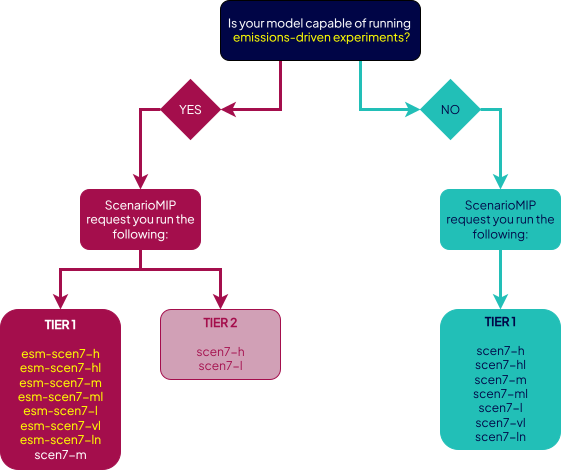

# CMIP7 Experiment Setup and Forcings Guidance

!!! tip "Documentation under development"

    The contents of these pages are currently in development.
    Their format and content will evolve as feedback is received on the drafts.
    We will remove this tip once the guidance is stable.
    If you have any feedback, please feel free to raise an issue at
    https://github.com/WCRP-CMIP/cmip7-guidance/issues/new and tag @znichollscr.

These pages provide guidance on the experimental setup and forcings to be used in CMIP7.
They are updated regularly, hence should be considered the current source of guidance.
The papers which describe the experiments in the scientific literature are the original source and key reference, but
they may still contain errors which cannot be fixed after publication so should not be relied upon in isolation.
[The papers](https://gmd.copernicus.org/articles/special_issue1315.html) also provide further information about each
simulation than what is provided here, such as the motivation, history and results from previous CMIP phases.

These pages specify the intended way to run each simulation.
However, we understand that modelling groups sometimes need to make changes for a variety of reasons.
We are currently discussing a mechanism for modeling centers to document these alterations in a central, publicly
accessible location (for example,
[discussion of how to choose values for the forcing 'f' identifier is ongoing](https://github.com/PCMDI/input4MIPs_CVs/issues/415)).
When these discussions are finalised, these guidance pages will be updated.
<!-- TODO: do we have a section to cross-link to? -->

## DECK experiments

### CMIP

CMIP core common experiments i.e. the DECK (Diagnostic, Evaluation and Characterization of Klima).

These pages are intended as a summary guide only.
For full details of experiments, please see the following URLs:

- [https://doi.org/10.5194/gmd-18-6671-2025](https://doi.org/10.5194/gmd-18-6671-2025)

1. [piControl-spinup](./picontrol-spinup.md)
1. [piControl](./picontrol.md)
1. [esm-piControl-spinup](./esm-picontrol-spinup.md)
1. [esm-piControl](./esm-picontrol.md)
1. [historical](./historical.md)
1. [esm-hist](./esm-hist.md)
1. [1pctCO2](./1pctco2.md)
1. [abrupt-4xCO2](./abrupt-4xco2.md)
1. [piClim-control](./piclim-control.md)
1. [piClim-anthro](./piclim-anthro.md)
1. [piClim-4xCO2](./piclim-4xco2.md)
1. [amip](./amip.md)

## Assessment Fast Track (AFT) experiments

### AerChemMIP

Aerosols and chemistry model intercomparison project: exploration of aerosol chemistry.

These pages are intended as a summary guide only.
For full details of experiments, please see the following URLs:

- [https://doi.org/10.5194/gmd-10-585-2017](https://doi.org/10.5194/gmd-10-585-2017)

1. [piClim-CH4](./piclim-ch4.md)
1. [piClim-N2O](./piclim-n2o.md)
1. [piClim-NOx](./piclim-nox.md)
1. [piClim-ODS](./piclim-ods.md)
1. [piClim-SO2](./piclim-so2.md)
1. [hist-piAer](./hist-piaer.md)
1. [hist-piAQ](./hist-piaq.md)

### CFMIP

Cloud feedback model intercomparison project.
Focussed primarily on cloud feedbacks with a secondary focus on understanding of response to forcing, model biases,
circulation, regional-scale precipitation, and non-linear changes.

These pages are intended as a summary guide only.
For full details of experiments, please see the following URLs:

- [https://doi.org/10.5194/gmd-10-359-2017](https://doi.org/10.5194/gmd-10-359-2017)

1. [abrupt-2xCO2](./abrupt-2xco2.md)
1. [abrupt-0p5xCO2](./abrupt-0p5xco2.md)

### C4MIP

Coupled climate carbon cycle model intercomparison project: exploration of the response of the coupled carbon-climate
system.

These pages are intended as a summary guide only.
For full details of experiments, please see the following URLs:

- [https://doi.org/10.5194/egusphere-2024-3356](https://doi.org/10.5194/egusphere-2024-3356)
- [https://doi.org/10.5194/gmd-17-8141-2024](https://doi.org/10.5194/gmd-17-8141-2024)
- [https://doi.org/10.5194/gmd-9-2853-2016](https://doi.org/10.5194/gmd-9-2853-2016)

1. [1pctCO2-bgc](./1pctco2-bgc.md)
1. [1pctCO2-rad](./1pctco2-rad.md)

### ScenarioMIP

Future scenario experiments.
Exploration of the future climate under a (selected) range of possible boundary conditions.
In CMIP7, the priority tier for experiments is conditional on whether you are doing emissions- or concentration-driven
simulations.
There is no way to express this in the CVs (nor time to implement something to handle this conditionality).
This means that, for your particular situation, some experiments may be at a lower tier than is listed in the CVs.
For example, the `vl` scenario is tier 1 for concentration-driven models and tier 2 for emissions-driven models.
However, in the CVs, we have used the highest priority tier (across all the possible conditionalities).
Hence `vl` is listed as tier 1 in the CVs (even though it is actually tier 2 for emissions-driven models).
For details, please see the full description in the ScenarioMIP description papers.

These pages are intended as a summary guide only.
For full details of experiments, please see the following URLs:

- [https://doi.org/10.5194/egusphere-2024-3765](https://doi.org/10.5194/egusphere-2024-3765)

1. [scen7-vl](./scen7-vl.md)

The priority of ScenarioMIP experiments (expressed as Tier 1 and 2) is summarized in the flowchart below, which is based
on Table 1 of [Van Vuuren et al. 2026](https://gmd.copernicus.org/articles/19/2627/2026/).
Emissions-driven experiments, indicated in yellow, have names beginning with `esm-`.

- If your model is capable of running in emissions-driven mode, ScenarioMIP request emissions-driven scenarios, and
  additionally the concentration-driven experiment `scen7-m`, at Tier-1 (highest priority).
- If your model will run only the concentration-driven experiments, ScenarioMIP request all concentration-driven
  scenarios at Tier-1.

If you are running in emissions-driven mode, you are welcome to run other scenarios in concentration-driven mode, but
they have not been assigned a specific tier (i.e., are lowest priority).

<figure>
  
  <figcaption>ScenarioMIP experiments, with emissions-driven experiments indicated in yellow.</figcaption>
</figure>
