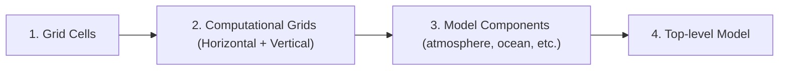
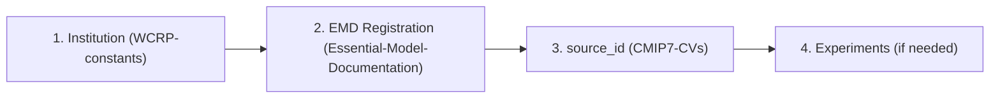

# CMIP7 Controlled Vocabulary Registration Guide

This guide explains how to register new entries in CMIP7 Controlled Vocabularies (CVs) such as institutions, models (source_id), experiments, and model documentation components.

---

## 1. Overview

CMIP7 uses **Controlled Vocabularies (CVs)** to ensure consistency across all participating modelling centres. Before publishing data, you must register:

- Your **institution** (organisation)
- Your **model** (source_id)
- Any new **experiments** (if applicable)
- **Model documentation** (EMD) components

Registration is done through **GitHub issue forms** that are linked below (no Git expertise required).

---

## 2. Registration Forms

### 2.1 Institution Registration

Register your institution before registering a model.

**PROCESS UNDER REVIEW**

**Repository**: [WCRP-constants](https://github.com/WCRP-CMIP/WCRP-constants/issues)

| Form | Link | Required Fields |
|------|------|-----------------|
| Organisation | [Register Institution](https://github.com/WCRP-CMIP/WCRP-constants/issues/new?template=organisation.yml) | Acronym, Full name, ROR |
 
**Notes**:
- The **acronym** used for the institution id must be unique and cannot be changed once data is published
- A **ROR** (Research Organisation Registry) identifier is required for traceability. Find yours at [ror.org](https://ror.org)
- ~Consortia are also registered as organisations~ To discuss: If we go with the esgvoc route, this will be handled differently. If we keep the current forms, there is a dedicated consortium form so why aren't we using that?

---

### 2.2 Model Registration (source_id)

**Important**: To register a `source_id`, you **must** complete the EMD (Essential Model Documentation) registration process.
Guidance on constructing a source id is provided in the [Source ID Guidance](Source_ID_guidance.md)

**Prerequisites**:
1. ~Institution registered (see 2.1)~ To discuss: Should not be required because this is not related to completing the EMD ?
2. EMD registration completed (see 2.4) - including grids, components, and top-level Model

**Repository**: CMIP7-CVs [Registered Content](https://github.com/WCRP-CMIP/CMIP7-CVs/tree/main/model/)

Source IDs and grid labels will be registered automatically within the CVs once EMD has been completed.
If you have completed the EMD but your source ID or grid label is not in the CVs,
please [open an issue in the CMIP7 CVs repository](https://github.com/WCRP-CMIP/CMIP7-CVs/issues/new?template=BLANK_ISSUE)
so we can figure out where the information processing has gone wrong.

---

### 2.3 Activity Registration

For new Activities (MIPs) not already in the CV.
If you previously did the activity registration process,
but your activity is not in the CV,
please check and engage on [this issue](https://github.com/WCRP-CMIP/CMIP7-CVs/issues/385)
which tracks the progress and process for adding these lost registrations
back into the CV.

**Repository**: CMIP7-CVs [Issues](https://github.com/WCRP-CMIP/CMIP7-CVs/issues?q=is%3Aissue%20state%3Aopen%20label%3Aactivity), [Registered Content](https://github.com/WCRP-CMIP/CMIP7-CVs/tree/main/activity)

| Form | Link |
|------|------|
| Activity (MIP) | [Register activity](https://github.com/WCRP-CMIP/CMIP7-CVs/issues/new?template=register-activity.yml) |

---

### 2.4 Experiment Registration

For new experiments not already in the CV.
If you previously did the experiment registration process,
but your experiment is not in the CV,
please check and engage on [this issue](https://github.com/WCRP-CMIP/CMIP7-CVs/issues/385)
which tracks the progress and process for adding these lost registrations
back into the CV.

**Repository**: CMIP7-CVs [Issues](https://github.com/WCRP-CMIP/CMIP7-CVs/issues?q=is%3Aissue%20state%3Aopen%20label%3Aexperiment), [Registered Content](https://github.com/WCRP-CMIP/CMIP7-CVs/tree/main/experiment)

| Form | Link |
|------|------|
| Experiment | [Register experiment](https://github.com/WCRP-CMIP/CMIP7-CVs/issues/new?template=register-experiment.yml) |

---

### 2.5 Essential Model Documentation (EMD)

EMD provides detailed technical documentation of your model. Registration follows a **hierarchical process** - you must register components in order. This should take a maximum of 4 hours wall time (although not all at once, as **each step has a separate review process**). 

For information on the EMD **please read the [DOCUMENTATION](https://wcrp-cmip.github.io/Essential-Model-Documentation/docs/Information_for_Submitters/Submission-Guide/)**

Other links: [GitHub Repository](https://github.com/WCRP-CMIP/Essential-Model-Documentation/issues)

#### Registration Order

#### Available Forms

| Stage | Form | You provide | You receive |
|-------|------|-------------|-------------|
| 1 | [Grid cells](https://github.com/WCRP-CMIP/Essential-Model-Documentation/issues/new?template=horizontal_grid_cell.yml) | Geometry, coordinates | `g###` |
| 1b | [Vertical grid](https://github.com/WCRP-CMIP/Essential-Model-Documentation/issues/new?template=vertical_computational_grid.yml) | Coordinate type, levels | `v###` |
| 2a | [Horizontal computational grid](https://github.com/WCRP-CMIP/Essential-Model-Documentation/issues/new?template=horizontal_computational_grid.yml) | Grid cell IDs, staggering | `h###` |
| — | [Model family](https://github.com/WCRP-CMIP/Essential-Model-Documentation/issues/new?template=model_family.yml) | Institution, domains | Family ID |
| 3a | [New model component](https://github.com/WCRP-CMIP/Essential-Model-Documentation/issues/new?template=model_component.yml) | Component details, grid IDs | Component ID + Config ID |
| 3b | [(or) Link existing component](https://github.com/WCRP-CMIP/Essential-Model-Documentation/issues/new?template=link_existing_component.yml) | Component ID, grid IDs | Config ID |
| 4 | [Model](https://github.com/WCRP-CMIP/Essential-Model-Documentation/issues/new?template=model.yml) | Config IDs, coupling | `source_id` |

---

## 3. Registration Workflow

### Overall Registration Order
TODO: update institution registration here based on outcome of discussion

### Step-by-Step Process

1. **Check if already registered**: Before creating a new entry, verify it doesn't already exist in the CV (see links above for how to check)
2. **Fill the form**: Click the appropriate link and complete all required fields
3. **Submit**: This creates a GitHub issue
4. **Automated checks**: The system performs initial validation
5. **Review**: A reviewer checks your submission
6. **Feedback loop**: You may be asked to make corrections
7. **Approval**: Once approved, the entry is merged into the CV

### Typical Timeline

- Simple registrations (institution, component configuration): 1-3 days
- Complex registrations (grid-cells, source-id): May take longer due to dependencies

### Tips

- **Don't wait**: Start EMD registration early - dependencies mean sequential steps
- **Check dependencies**: A Model Component cannot reference a grid that isn't registered yet, a source cannot refer to components that don't exist. 
- **Be precise**: Acronyms and identifiers cannot be changed after data publication
- **Ask for help**: Consult the documentation first, and if needed try the "General Issue" form for  questions.

---

## 4. After Registration

Key issue: this is the thing which isn't working. Based on the current workflows, teams can register institutes, and they will not end up in esgvoc or CMOR tables and data will not pass QA/QC validation

Once your data is registered:

1. The **esgvoc** library will include your entries in the next update
2. You can use your registered identifiers in CMOR tables
3. Your data will pass QA/QC validation for these CV fields

---

## 5. Tools & Resources

### esgvoc Library

The `esgvoc` Python library provides programmatic access to all CVs:

- GitHub: https://github.com/WCRP-CMIP/esgf-vocab
- Documentation: https://esgf.github.io/esgf-vocab/

### CV Repositories

| Repository | Content |
|------------|---------|
| [CMIP7-CVs](https://github.com/WCRP-CMIP/CMIP7_CVs/) | CMIP7-specific CVs (source_id, experiment) |
| [WCRP-Universe](https://github.com/WCRP-CMIP/WCRP-Universe/) | ESGVOC collection for all projects |
---

### EMD Repositories

These repositories maintain the information used by the EMD.
Some of the information is automatically translated out into the CV repositories,
but these EMD repositories are not themselves CV repositories.
To discuss: the line below is factual and probably the key source of our issues.
**Your data is only registered in the CVs if it appears in the CVs repositories above. Registration in the EMD repositories alone is not registration in the CVs.**

| Repository | Content |
|------------|---------|
| [WCRP-constants](https://github.com/WCRP-CMIP/WCRP-constants/) | Organisations/institutions, and universal constants e.g. frequency,realm etc. **UNDER REVIEW**|
| [Essential-Model-Documentation](https://github.com/WCRP-CMIP/Essential-Model-Documentation/) | EMD components |
---

## 6. Getting Help

- **Question about a specific CV value**: Open a [CV value issue](https://github.com/WCRP-CMIP/CMIP7-CVs/issues/new?template=cv-value.md) in the CMIP7 CVS repository
- **CV discussions**: See [Discussions on the CVs repo](https://github.com/WCRP-CMIP/CMIP7-CVs/discussions)
- **General questions**: Open a [blank issue](https://github.com/WCRP-CMIP/CMIP7-CVs/issues/new?template=BLANK_ISSUE) in the CMIP7 CVS repository and ask your question. Please include as much context and other helpful information as possible.
To discuss: remove this? It just adds to the IPO's workload. If there are complex questions, just use the blank issue (and tag specific people?) and we'll triage from there. Alternately, email the CVs TT co-chairs, Karl and Laurent too.
- **Contact IPO**: For complex cases, contact the [CMIP International Project Office](mailto:cmip-ipo@esa.int)
